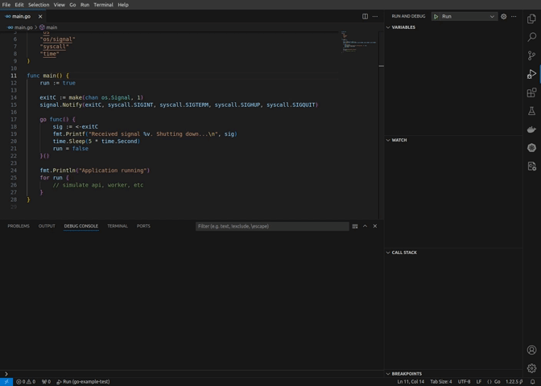

# VSCode Process Signal

VSCode Process Signal provides a simple way to send signals to vscode child processes

## Features

Pressing `alt+Q` or `F1 + Send Signal` will pop up a window to select a process and then another window to select the signal to be sent to that process.

Only processes that are child of Visual Studio Code itself and the childs of the childs will be available to kill.

## Requirements

If you have any requirements or dependencies, add a section describing those and how to install and configure them.

## Extension Settings

This extension contributes the following settings:

* `vscode-process-signal.sendSignal`: This command shows a window to select a process and then another window to select the signal to be sent to that process. Only processes that are child of Visual Studio Code itself and the childs of the childs will be available to kill.

## Known Issues

This extension currently does not support windows.

## Release Notes

### 1.0.0

Initial release of VSCode Process Signal

---

**Enjoy!**
